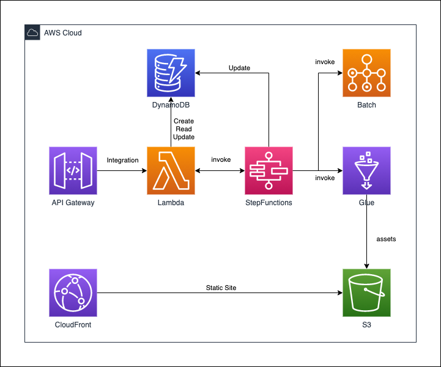

# AWS CDK small Examples

This repository contains a set of example projects for the [AWS Cloud Development Kit](https://github.com/aws/aws-cdk).

## Environment

The code in this repository is checked under the environment below.

* []()
* [](https://formulae.brew.sh/formula/aws-cdk)
* [](https://www.python.org/downloads/release/python-377/)

# Python examples


## Deploy

In each directory,

```
$ cdk ls
```

and then,

```
$ cdk deploy {target_name}
```

finally you should destroy everything.

```
$ cdk destroy {target_name}
```

## Contents

| Example | Description |
|:--:|:--:|
| [apigw-lambda](./python/apigw-lambda)  | Creating a API Gateway method integrated with Lambda. |
| [api-cors-lambda](./python/api-cors-lambda) | from [](https://github.com/aws-samples/aws-cdk-examples/tree/master/python/api-cors-lambda) |
| [apigw-dynamodb-lambda](./python/apigw-dynamodb-lambda) | Creating DynamoDB with accessors via Lambda & via API Gateway, based on [](https://github.com/aws-samples/aws-cdk-examples/tree/master/python/dynamodb-lambda) |
| [apigw-dynamodb-sfn-with-heavytask](./python/apigw-dynamodb-sfn-with-heavytask) | Creating DynamoDB, API Gateway, and StepFunctions to achieve quick response with API-GW and to process heavy task with SFn. |
| [batch-stepfunctions](./python/batch-stepfunctions)  | Creating VPC and AWS Batch using ECR which already pushed, and invoke AWS Batch via StepFunctions with CloudWatch Events. |
| [batch-stepfunctions-nested](./python/batch-stepfunctions-nested)  | Creating VPC and AWS Batch, and invoke AWS Batch via StepFunctions with CloudWatch Events using NESTED. |
| [cloudfront-s3](./python/cloudfront-s3)  | Creating a CloudFront using S3. |
| [glue-stepfunctions](./python/glue-stepfunctions)  | Creating a Glue Job, and execute on StepFunctions. |
| [lambda-stepfunctions](./python/lambda-stepfunctions)  | Creating a multiple Lambda with package, and invoke StepFunctions. |
| [lambda-creating-lambda_layers](./python/lambda-creating-lambda_layers)  | Creating a Lambda which puts a zip file for LambdaLayers in S3. |
| [waf-alb-ec2-glue-athena-s3](./python/waf-alb-ec2-glue-athena-s3)  | Creating resources to analyze DoS-attack detected by WAF. |
| [select-existing-resources]()  | Select existing resource, VPC, Lambda, etc. |


* Overview



## Contents which will be added

* lambda with LambdaLayer
* select existing vpc
* StepFunctions(lambda, SQS, SNS)
* Athena (=Glue Crawler)
* DynamoDB
* EKS
* Kinesis
* API Gateway (+ custom domain)
* CloudFront (+ custom domain)
* Beanstalk

# References

* [aws-samples/aws-cdk-examples](https://github.com/aws-samples/aws-cdk-examples)

# License

* This library is licensed under the Apache 2.0 License (same as origin).