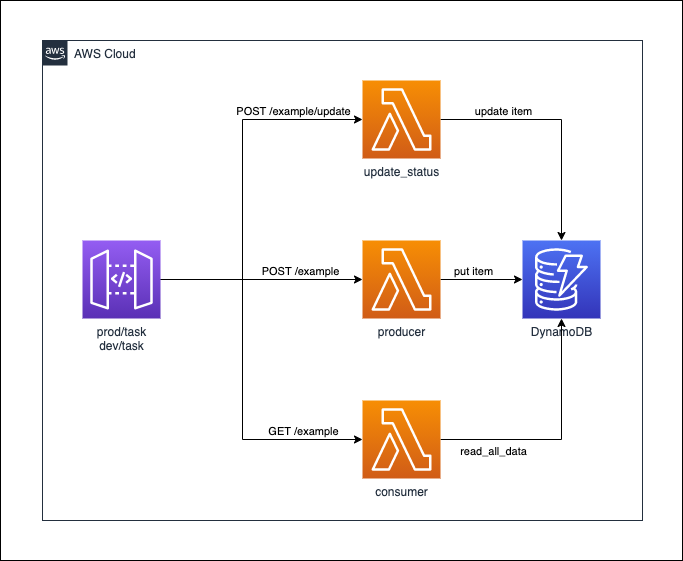

# apigw-dynamodb-lambda

[](https://formulae.brew.sh/formula/aws-cdk)


## generating resources




* DynamoDB
* Lambda
* API Gateway

## usage

### 1. via Lambda

* producer: example

```json
{
  "name": "car",
  "status": "runnable"
}
```

* consumer: example

```
no
```

* update_status: example

```json
{
  "id": "{given_id}",
  "status": "broken"
}
```


### 2. via HTTP GET or POST

* producer: example

```shell script
$ curl -X POST -H 'Content-Type:application/json' -d '{"name": "car", "status": "runnable"}' {given_url}/example
```


* consumer: example

```shell script
$ curl -X GET {given_url}/example
```


* update_status: example

```shell script
$ curl -X POST -H 'Content-Type:application/json' -d '{"id": "{give_id}", "status": "runnable"}' {given_url}/example/update
```

