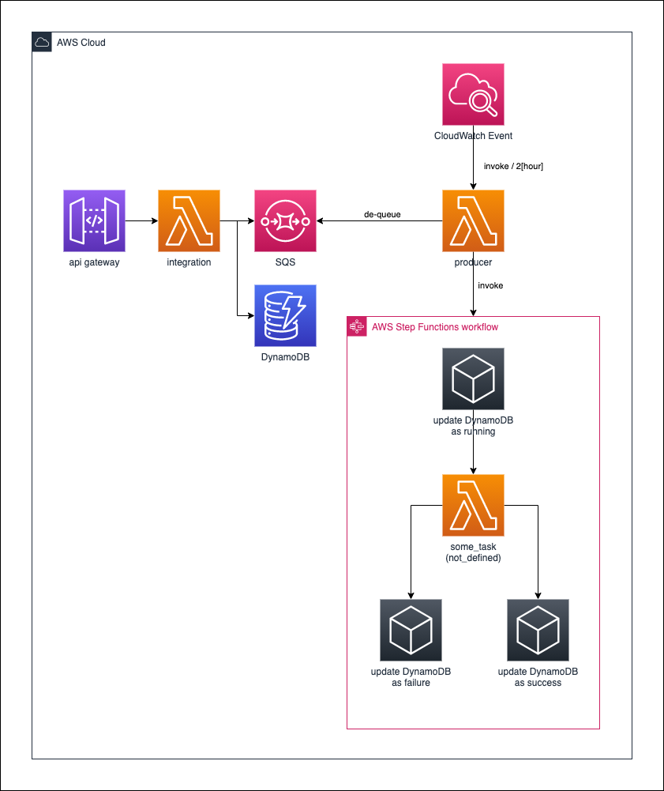

# apigw_lambda

[](https://formulae.brew.sh/formula/aws-cdk)


## generating resources



* API Gateway
* Lambda
    1. integrated with API
    2. to invoke StepFunctions
* DynamoDB
* SQS
* StepFunctions
    * to consume heavy task with updating `status` in DynamoDB

## usage

* 1: store new data

```shell script
$  curl -X POST -H 'Content-Type:application/json' -d '{"status": "aaaa"}' {given_url}/example

# response
{
  "insert": {
    "status": "aaaa",
    "id": "27d937cd-8848-427c-9b7c-f5e9200924d3"
  }
}
```

* 2: two hours later, the `id` is processed automatically by the StepFunctions

the status of the id is changed, maybe `success` or `failure`.

* 3: check the status of the registered `id`s

```shell script
$ curl -X GET  {given_url}/example
```

# References

* [Developers.io](https://dev.classmethod.jp/articles/aws-cdk-stepfunctions-pass-events-to-error-task/)