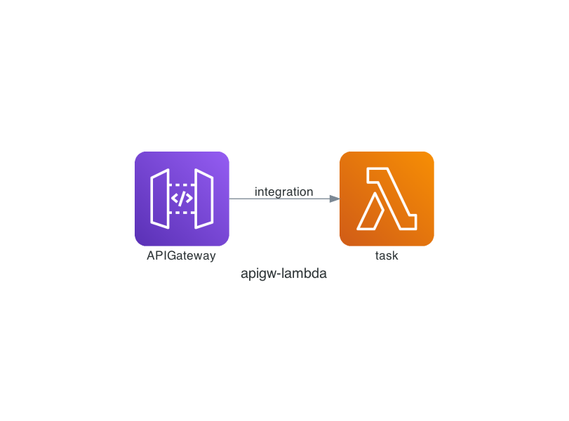

# apigw_lambda


## generating resources



## deploy

```shell script
# for dev
$ cdk deploy ApigwLambda-dev
# the url would be  https://[a-z0-9].execute-api.ap-northeast-1.amazonaws.com/dev/

# for prod
$ cdk deploy ApigwLambda-prod
# the url would be  https://[a-z0-9].execute-api.ap-northeast-1.amazonaws.com/prod/
```

## usage

* 1: run curl

```shell script
$ curl -X POST -H "Content-Type:application/json" -d '{"time": "2020-11-01T12:00:00Z"}' https://[a-z0-9].execute-api.ap-northeast-1.amazonaws.com/(prod/dev)/task
```

* 2: the result is

```shell script
{
    "dt": "2020-11-01"
}
```

## reference

* [add resource policy](https://medium.com/@martinkuzdowicz/aws-cdk-template-for-api-gateway-with-resource-policy-dc17a487718)
