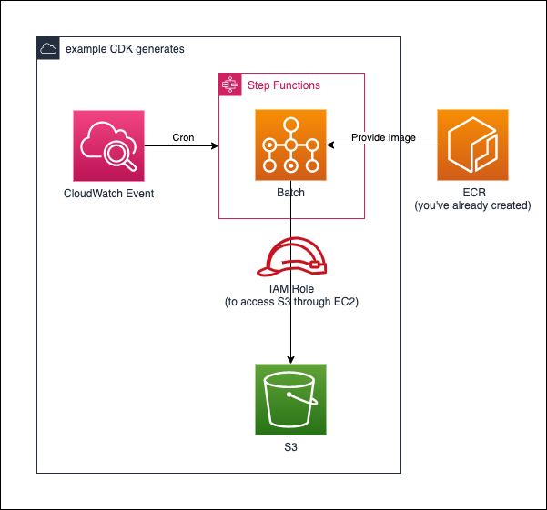

# batch-stepfunctions

## generating resources

* VPC
* AWS Batch
* StepFunctions
* CloudWatch Events
* IAM Role

## Why using StepFunctions ?

Although CloudWatch Events is also able to invoke AWS Batch,
it is not flexible to pass arguments through CloudWatch Events.

In addition, AWS Batch may be used within StepFunctions utilizing other AWS services, such as Lambda.

# References

* [Qiita](https://qiita.com/gsy0911/items/64d0f79601cb906cd235)
