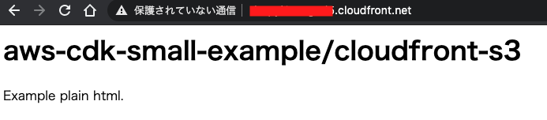

# cloudfront-s3

## generating resources

* S3
    * generate new `S3 Bucket`
    * deploy assets to `web/static` in the Bucket
* CloudFront
    * use Origin with the Bucket above
    * default domain (not custom domain)

## result

after you deploy, access via CloudFront-console domain name

# References

* [Qiita for the concept of CloudFront](https://qiita.com/NaokiIshimura/items/46994e67b712831c3016)
