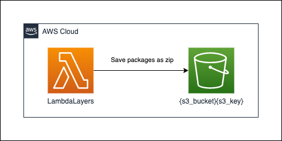

# lambda-creating-lambda_layers

## generating resources




## usage

* 1: put lambda json

```json
{
  "s3_bucket": "{your_s3_bucket}",
  "s3_key": "python3.8.zip",
  "package_list": ["pandas", "cerberus"]
}
```

* 2: run lambda

* 3: check your s3 

# References

* [Qiita](https://qiita.com/gsy0911/items/07e820a213d1e81fbe0d)